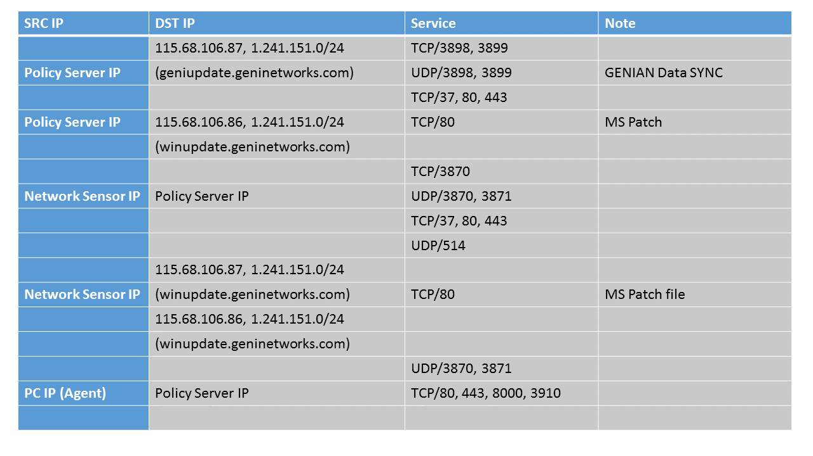

Deploying Genian NAC
--------------------

Genian NAC can be either On-Premise or Cloud Managed depending on your environment and network requirements.
The Allowed Ports graphic shows what ports will be used by Genian NAC.

Allowed Ports

(*The above ports need to be open and accessible to allow the Policy Server to get weekly/monthly updates from the Genians Platform DB*)

.. toctree::
   :maxdepth: 2

   deploying/on-premise
   deploying/cloud-managed
   deploying/deploying-agent-intro